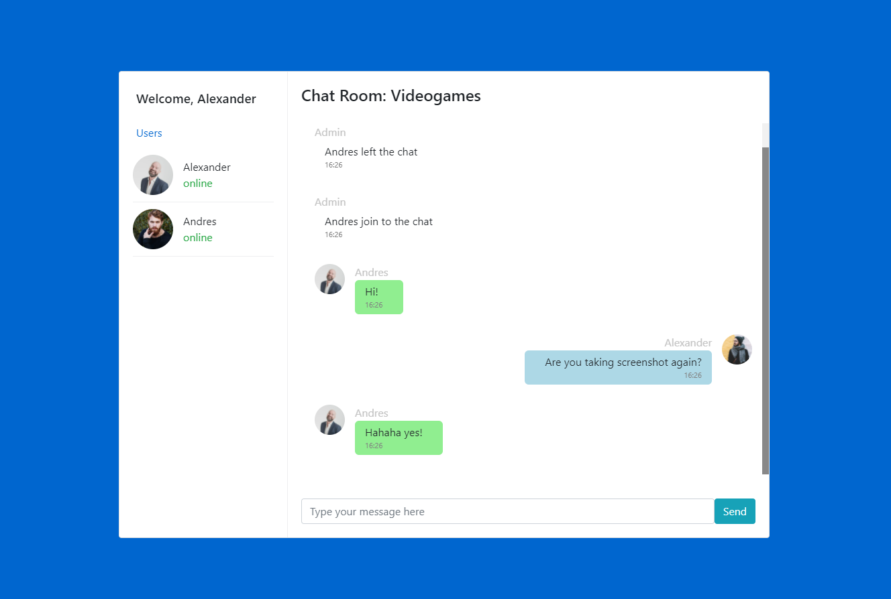
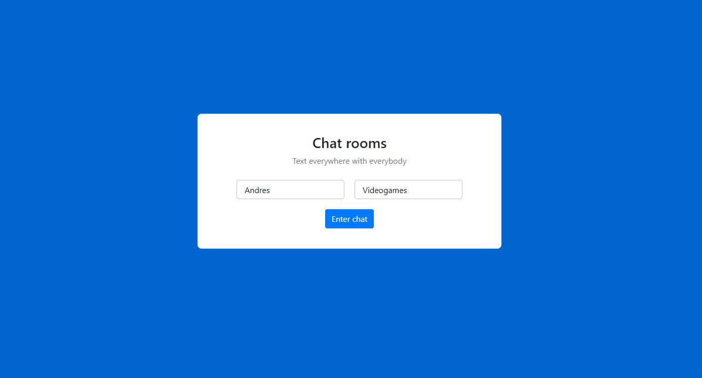

## :rocket: Socket-chat


### :memo: Description

Socket-chat it's an application where you can enter and create chat rooms for you and your friends, no tracking, no registry, totally anonymous. what are you waiting for?



### :sparkles: Features

- Update in real time.
- Connection with different users.
- Responsive design.

### :alembic: Core Concepts

- Socket.io
- Real time
- Modal-pattern

### :construction: Made with

- Vanilla JS
- Jquery
- Socket.io
- animate.css
- Html
- Css

### :hammer: Demostration

Its a simple app, you can open here

```
https://socket-chats.onrender.com/
```

Or you can watch the video

```
https://youtu.be/Y4DOhaW6wfY.
```



### :bulb: Run the App

Clone repo and type `npm install` and then `nodemon server/server` or `npm run start`

_If you want to contribute to improve the project, please create your PR and write me :speech_balloon: . After it, sit down and take a beer, you deserve it!_ :beers: .
_This project is for academic purposes only, all right reserved. Andrés Andrade 2021 :copyright::registered:_
